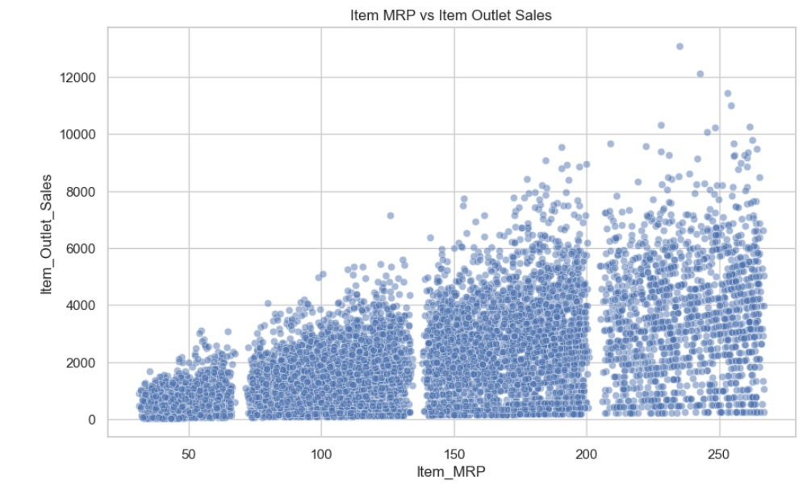
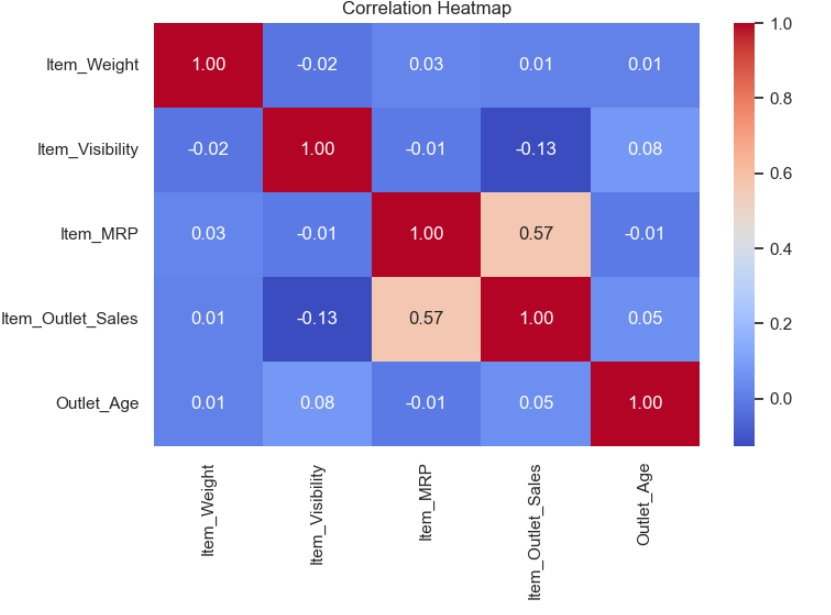

# Big Mart Sales EDA Project - MTECH-PES University

## Overview
This project performs exploratory data analysis (EDA) on the `big_mart_sales.csv` dataset as per the project instructions. This is part of EDA Assignment as part of MTECH from PES University, Bangalore. Include
key findings, interesting visualizations, and potential next steps.

## Deliverables
- `EDA_Project_SamirPaul.ipynb` – Jupyter Notebook with markdown, code, visualizations, and insights
- 'Presentation_EDA_Project_SamirPaul.pptx' - Presentation
- `big_mart_sales.csv` – source dataset
- `PDS_ProjectInstructions_Oct25B.pdf` – assignment instructions

## What is covered
- dataset selection justification
- data loading and inspection
- missing value handling
- inconsistent category cleaning
- duplicate check
- descriptive statistics
- numerical and categorical visualizations
- correlation analysis
- group-by analysis
- pivot tables
- advanced Python techniques:
  - list comprehensions
  - lambda functions
  - user-defined functions
- insights and conclusions

## Missing Values

## Main Insights
- Outlet type has strong impact on average sales
- Supermarket formats outperform grocery stores
- Item MRP has the strongest positive relationship with sales among numerical features
- Item visibility has a negative relationship with sales in this dataset

## Interesting Visualizations

## Recommended next step
Build a predictive model for `Item_Outlet_Sales` using cleaned features.
