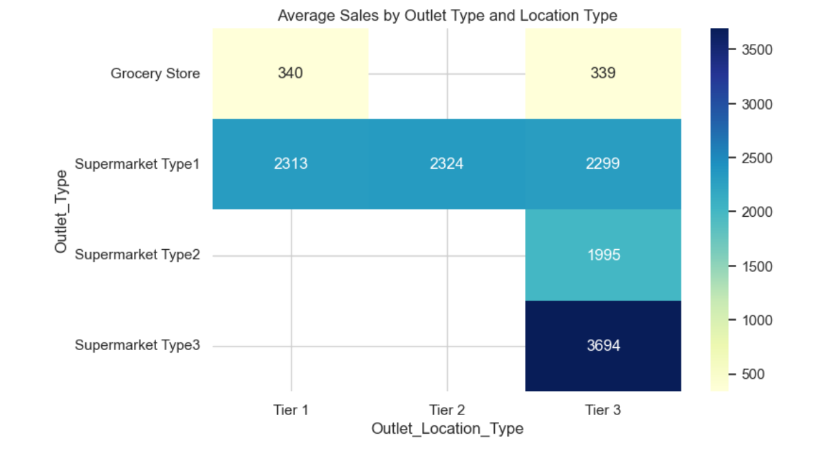

# Big Mart Sales EDA Project - MTECH-PES University

## Overview
This project performs exploratory data analysis (EDA) on the `big_mart_sales.csv` dataset as per the project instructions. This is part of EDA Assignment as part of MTECH from PES University, Bangalore. Include
key findings, interesting visualizations, and potential next steps.

## Deliverables
- `EDA_Project_SamirPaul.ipynb` – Jupyter Notebook with markdown, code, visualizations, and insights
- 'Presentation_EDA_Project_SamirPaul.pptx' - Presentation
- `big_mart_sales.csv` – source dataset
- `PDS_ProjectInstructions_Oct25B.pdf` – assignment instructions

## What is covered
- Dataset selection (8523 rows x 12 columns)
- Data loading and inspection
- Checking for Duplicate rows
- Missing value handling
- Inconsistent category cleaning
- Descriptive statistics (EDA)
- Numerical and categorical visualizations (EDA) - Univariate and Bi-variate
- Correlation analysis - explore relationships between numerical features.
- Box plots to identify outliers and understand the spread of the data.
- Perform group-by operations to aggregate data based on categorical features.
- Pivot tables
- Advanced Python techniques:
  - List comprehensions
  - lambda functions
  - User-defined functions
 - Insights and conclusions

## # of Rows and Columns in dataset

Number of rows = 8523    
Number of columns =12

## Missing Values

Following fields have missing values:

Item_Weight
Outlet_Size

Interpolate missing data based on the context.
Standardize inconsistent Item_Fat_Content labels.

## Feature Analysis

Performed Univariate and Bi-variate analysis to identify the key drivers that influence 'Item Outlet Sales'
Create useful derived features such as Outlet_Age, Item_Category, MRP_Band, and Visibility_Band

## Main Insights
- Outlet type has strong impact on average sales
- Supermarket formats outperform grocery stores
- Item MRP has the strongest positive relationship with sales among numerical features
- Item visibility has a negative relationship with sales in this dataset
- Tier 2 and Tier 3 locations perform better than Tier 1 on average sales.

## Interesting Visualizations

## Recommended next step

-Build a predictive regression model for Item_Outlet_Sales` using cleaned features.
-Encode categorical variables and test feature importance.
-Compare algorithms such as Linear Regression, Random Forest, and XGBoost.
